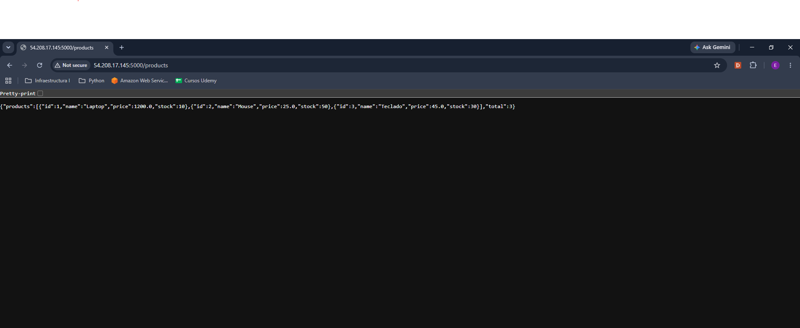
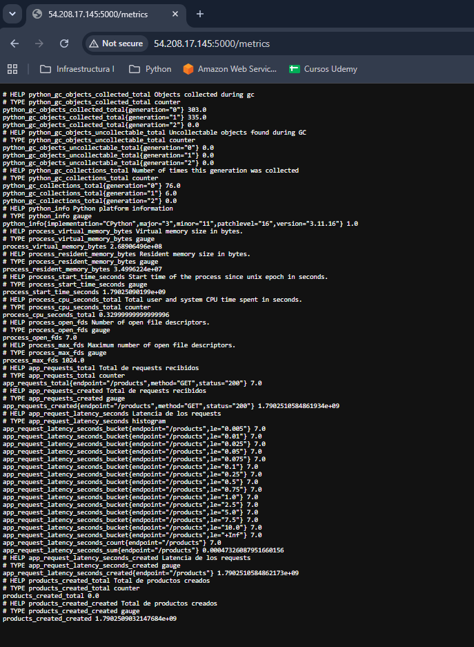
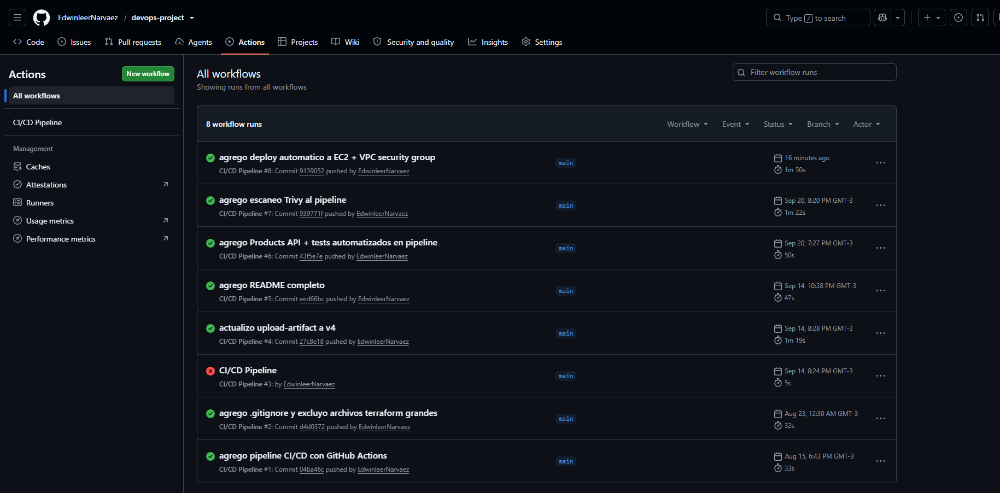
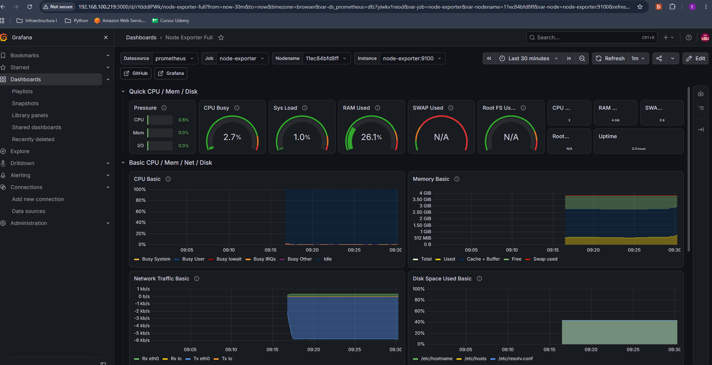
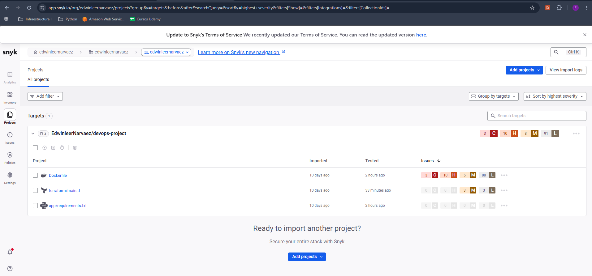
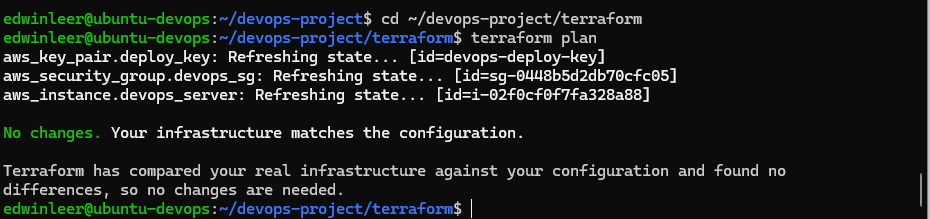
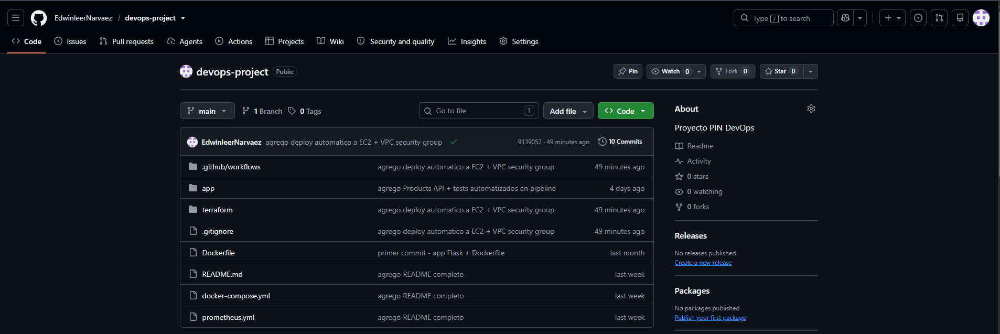

# Products API — Proyecto Integrador DevOps

## Descripción

API REST de gestión de productos con pipeline CI/CD completo, integrando Docker, GitHub Actions, Terraform, Snyk, Trivy y Prometheus/Grafana. Deploy automático a AWS EC2.

## Tecnologías utilizadas

- **App:** Flask (Python) + Prometheus client
- **CI/CD:** GitHub Actions
- **Contenedores:** Docker + Docker Compose
- **IaC:** Terraform (AWS EC2 + Security Group + Key Pair)
- **Seguridad:** Snyk + Trivy + SBOM CycloneDX
- **Monitoreo:** Prometheus + Grafana (Node Exporter)
- **Deploy:** Automático a AWS EC2 vía SSH en cada push a main

## Estructura del proyecto

```
devops-project/
├── .github/workflows/ci.yml
├── app/
│   ├── app.py
│   ├── test_app.py
│   └── requirements.txt
├── terraform/
│   ├── main.tf
│   └── variables.tf
├── docs/
│   └── capturas/
├── docker-compose.yml
├── prometheus.yml
└── Dockerfile
```


## Endpoints de la API

| Método | Endpoint | Descripción |
|--------|----------|-------------|
| GET | /  | Estado de la app |
| GET | /health | Health check |
| GET | /info | Información de la API |
| GET | /products | Lista todos los productos |
| GET | /products/id | Obtiene un producto |
| POST | /products | Crea un producto |
| DELETE | /products/id | Elimina un producto |
| GET | /metrics | Métricas Prometheus |

## Pipeline CI/CD

Cada push a main ejecuta automáticamente:

1. Tests — 6 tests con pytest
2. Build — imagen Docker
3. Snyk — escaneo de vulnerabilidades
4. Trivy — escaneo de imagen Docker
5. SBOM — generación con CycloneDX
6. Deploy — despliegue automático a AWS EC2

## Cómo ejecutar localmente

git clone https://github.com/EdwinleerNarvaez/devops-project.git
cd devops-project
docker compose up -d


| Servicio | URL |
|----------|-----|
| App | http://localhost:5000 |
| Prometheus | http://localhost:9090 |
| Grafana | http://localhost:3000 |

## Infraestructura AWS

cd terraform
terraform init
terraform apply

Crea: instancia EC2 (t2.micro), Security Group (puertos 22 y 5000), y Key Pair para deploy automático.

## Monitoreo

- Prometheus recolecta métricas cada 15s
- Métricas propias: app_requests_total, app_request_latency_seconds, products_created_total
- Dashboard: Node Exporter Full (ID: 1860)

## Evidencias

### API funcionando en producción (AWS)


### Métricas propias expuestas a Prometheus


### Pipeline CI/CD ejecutado exitosamente


### Dashboard de Grafana con métricas reales


### Escaneo de seguridad con Snyk


### Infraestructura desplegada en AWS con Terraform


### Estructura del repositorio


## Autor

EdwinLeer Narváez — Diplomatura DevOps, MundosE.
